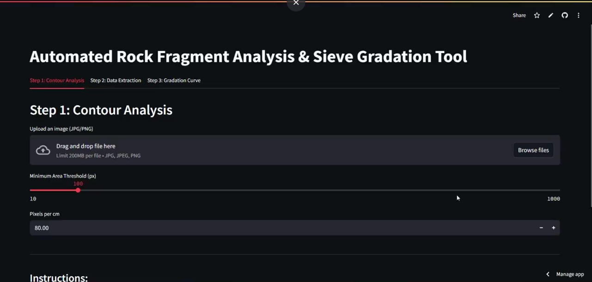
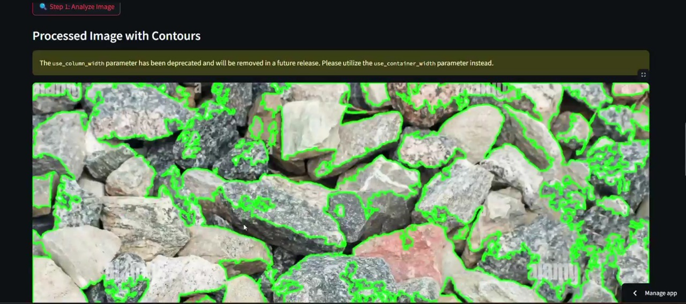
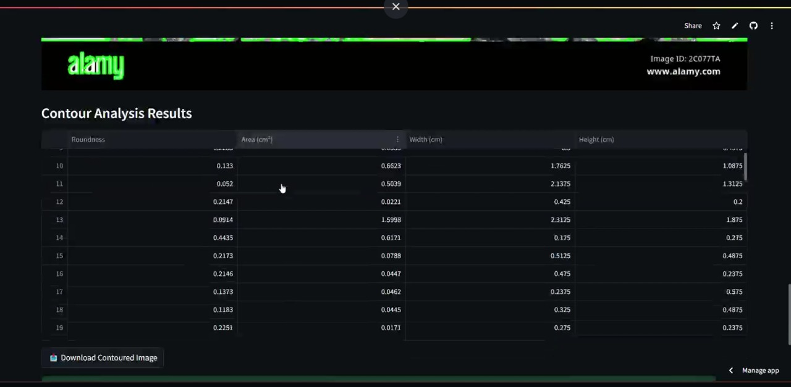
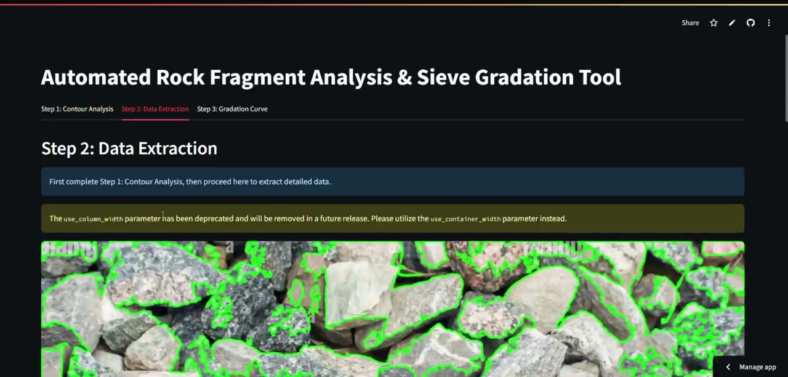
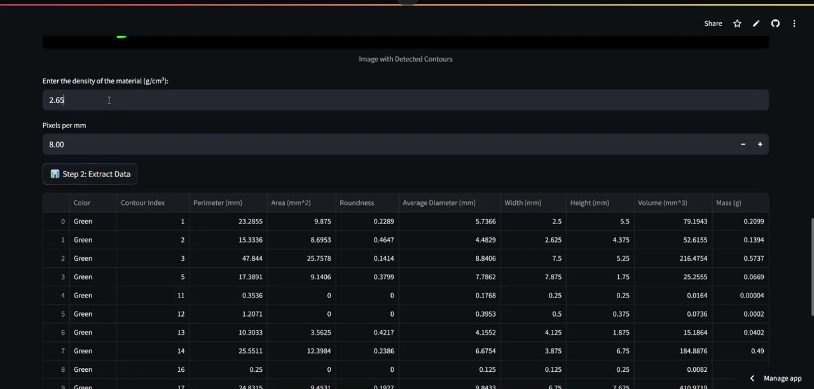
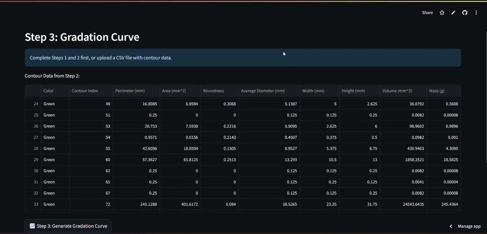
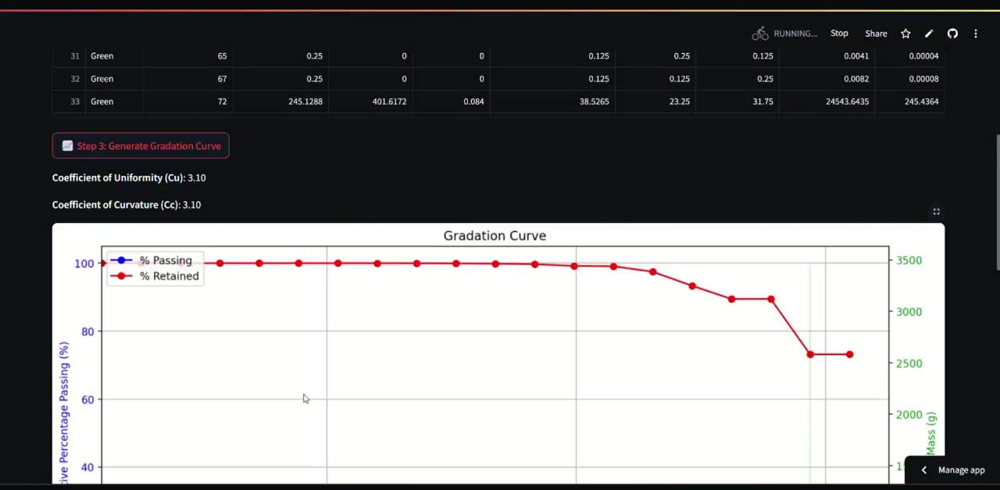

#  Automated Rock Fragment Analyzer & Sieve Gradation Tool

An end-to-end AI-powered tool for automating the detection, measurement, and analysis of rock fragments using image processing techniques. The app is built using **Streamlit**, **OpenCV**, **NumPy**, and **Pandas**, providing a highly interactive and user-friendly interface for mining engineers, researchers, and geologists.

---

##  Project Objective

The goal of this project is to automate the **rock fragmentation analysis process**, which traditionally involves manual measurements. This tool enables:
- Efficient contour detection of rock fragments from images.
- Extraction of geometric and physical parameters (area, diameter, roundness, volume, mass).
- Gradation analysis and plotting of sieve curves.
- Export of results in PDF, CSV, and Excel formats.

---

## 🛠 Technologies Used

- **Python 3.12**
- **Streamlit** – for interactive web UI.
- **OpenCV** – for contour detection and image processing.
- **NumPy & Pandas** – for mathematical operations and tabular data.
- **Matplotlib** – for generating the gradation curve.
- **Pillow (PIL)** – for image manipulation.
- **ReportLab / openpyxl** – for PDF/Excel export functionality.
- **tempfile, io, os** – for file management.

---

##  Step-by-Step Workflow

###  Step 1: Contour Analysis

- Upload a rock fragmentation image (JPG/PNG).
- Select a **minimum area threshold** to filter noise.
- Provide the **scale (pixels per cm)** for accurate physical measurement.
- The app detects contours, filters valid fragments, calculates roundness and dimensions, and overlays the result.
- **Output**: Annotated image and contour analysis table.

** Screenshot: Original + Contoured Image**  

---

###  Step 2: Data Extraction

- Use the previously processed image or upload an externally contoured image.
- Input material **density (g/cm³)** and **pixels per mm**.
- The app extracts detailed contour information:
  - Perimeter, area, width, height (mm)
  - Average diameter
  - Roundness
  - Estimated volume and mass (g) based on shape assumptions
- **Output**: Downloadable CSV containing all data.

** Screenshot: Extracted Data Table**  

---

###  Step 3: Gradation Curve Generation

- Uses extracted contour data or a user-uploaded CSV.
- Groups fragments into logarithmic sieve size bins.
- Computes % passing, % retained, and cumulative mass.
- Plots a **gradation curve** with dual y-axes (passing % & mass).
- Calculates:
  - D10, D30, D60
  - **Coefficient of Uniformity (Cu)**
  - **Coefficient of Curvature (Cc)**
- **Output**: Gradation curve, analysis table, downloadable Excel report.

**📸 Screenshot: Gradation Curve**  

---

##  Outputs

- ✅ Annotated image with contours.
- ✅ CSV file containing contour-based measurements.
- ✅ Excel file with contour data + gradation summary.
- ✅ Gradation curve plot (plotted inline).

---

---

## 📌 Notes & Recommendations

- Ensure images are taken **top-down** with a consistent scale or reference object.
- Avoid shadows or overexposure for better contour detection.
- Use homography-based **image calibration** for precise scaling.
- For optimal accuracy, test different threshold values and calibrate properly.
- The contour detection filters by area and roundness to eliminate false positives.

---

##  Author

Developed by [Kritika Sinha ]  

---

